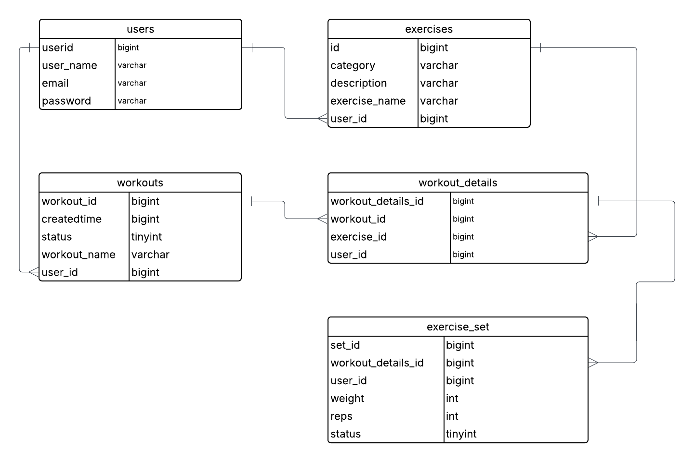

# 🏋️‍♀️FitPlus (An easy way to Track your Workouts)

---

## Description:
    
- The Primary Goal of this app is to Track Workouts Effectively.
- App enables the user to Track Exercises with Weights and Reps. This will help to make Progressive Overloading in any workout.
- A user can Create multiple workouts with any number of Exercises. And an Exercise can have any number of sets (Combination of Weights and Reps)
- A user can Mark a Set/Workout as completed (or) pending.
- There are no predefined Exercises in the app. User have to create Exercises and then use it to track workouts
- A user can effectively Create/Edit/Delete a Workout/Exercise/Set.

---

## Frameworks Used:

- Build tool: Maven
- Spring Boot Starter Web (For Rest APIs)
- Spring Boot Security (For authentication)
- Spring Boot Data JPA (For database connectivity)
- Spring Boot Stater Validations (For Param Validations)

---

## Data Modeling:

  

--- 

## Learnings:

- Authenticate a user with spring security. (Simple Authentication)
- User Data Segmentation in a single DB using FK reference
- Global Exception handling using `RestControllerAdvice` and `ExceptionHandler` annotations
- Setting current User ID in ThreadLocal by extending `OncePerRequestFilter`.
- User ID injecting using `AttributeConverter`
- Data Access using JPA Repositories.
- Defining entities with Relationships.
- How to receive payloads using DTO classes.
- How to return responses using DTO classes.
- Annotations Used
  - Entity
  - Id
  - GeneratedValue
  - Column
  - Email
  - JoinColumn
  - OnDelete
  - ManyToOne
  - OneToOne
  - NotNull
  - NotEmpty
  - RestController
  - RequestMapping
  - PostMapping
  - PutMapping
  - DeleteMapping
  - GetMapping
  - Repository
  - Query
  - Service
  - Bean
  - Configuration
  - Enumerated
  - Component
  - PersistenceContext
  - Converter
  - MappedSuperClass
  - Convert
